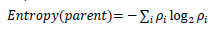
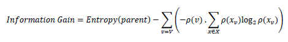
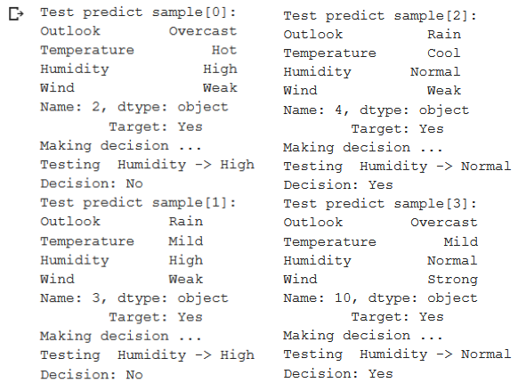

# ID3_Decision_Tree
Building the decision tree model from scratch using the ID3. The ID3 (Iterative Dichotomies 3) algorithm is classifying the data by splitting attributes based on their entropy.

# ID3 algorithm
The algorithm consists of several modules to build decision trees and predict the classification. There are two main modules dan other modules for fitting the model, predicting the result, and printing the outcome. The two main modules are the entropy computation and information gain computation. The entropy computation includes the mathematical calculation to calculate the homogeneity of the data. Information gain computation includes the entropy calculation to decide the most relevant attributes. These two main modules will be explained more in the next sections. As with the algorithm name, it uses a tree node the data structure. This is chosen because it can contain the parent and children nodes as a subtree of the root node.

# Entropy
It is a measure of the impurity of a random collection of samples. It controls the split of data in this
algorithm. It is defined in the equation below:

with 𝜌𝑖 as the number of class 𝑖 samples in parent node / total number of samples. The minimum
value from the entropy calculation of every attributes is chosen for the split. 0 to 1 is the
mathematical entropy range. This will be used later in the information gain calculation. The
children node entropy of 0 indicates it belongs to one corresponding class. Further splitting is
needed if the entropy is more than 0.

# Information Gain

Information gain measures the reduction amount of entropy by partitioning the examples
according to this attribute. It ranks attributes and builds the decision tree where at each node is
located the attribute with the highest information gain among the attributes.

with 𝜌(𝑣) as the proportion of samples number of values in the corresponding attribute to the
number of samples of all values in corresponding attribute and 𝜌(𝑥𝑣 ) as the number of class
samples in corresponding attribute / total number of class samples. 

# Evaluation Results
The most result of model evaluation with 80:20 splitting ratio of training and test was not producing the same result as the target or the ground truth. This happened because the dataset is small, and the model needed to train the information in 80% of that dataset data and tried to predict a little data. The split ratio of 70:30 in dataset seemed to produce a better prediction as the data is divided into a quite more balanced way. It predicts half of the prediction with correct decisions as can be seen in below.

Only the model prediction result from the dataset that was not split produces the same result as the target ground base. However, this is inappropriate to be sued for evaluating the model because the model was using the same data for model training which can result in overfitting.
